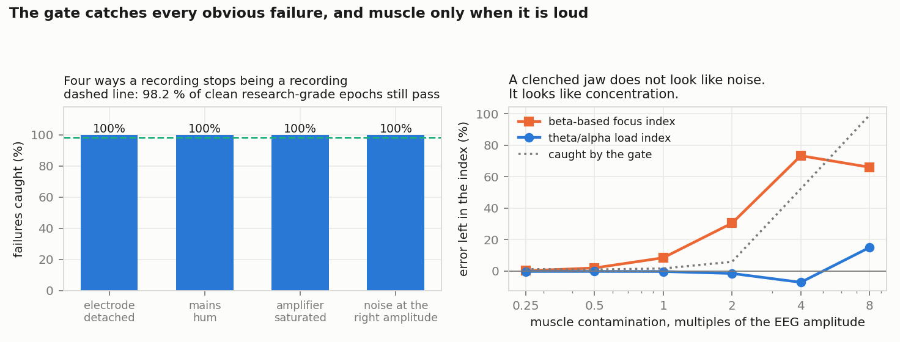
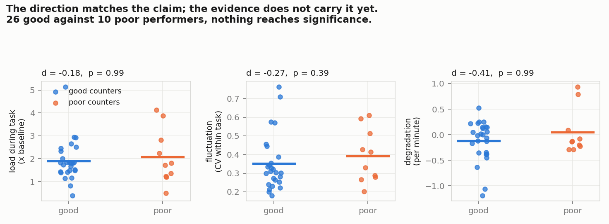
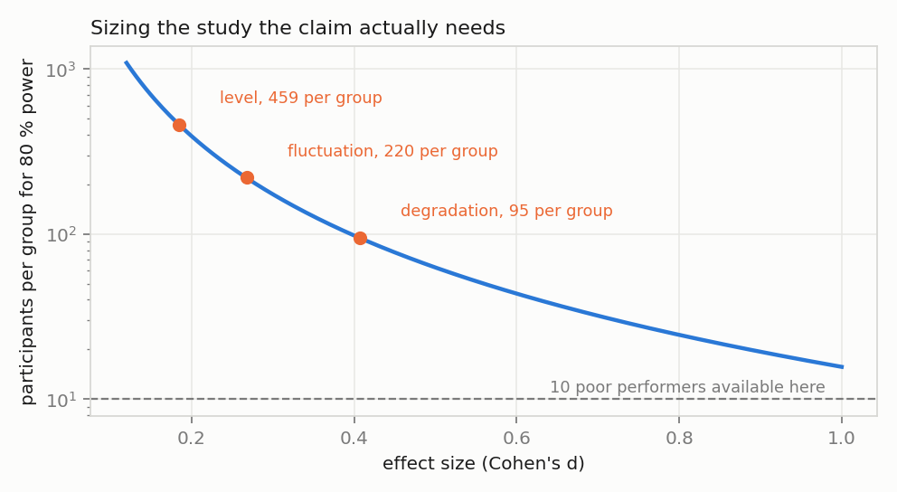
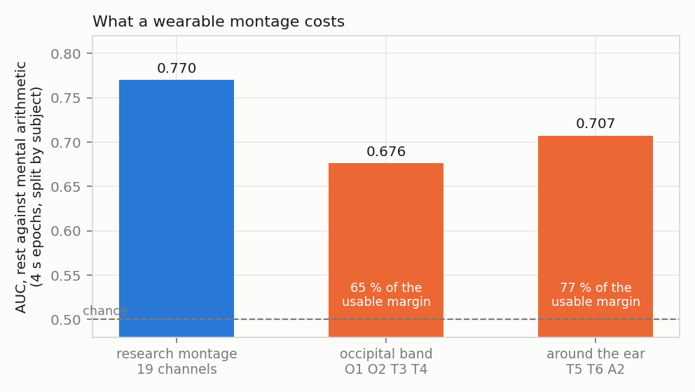

# EEG for stress and focus, under conditions that break EEG

**Before any number about concentration leaves the pipeline, prove the signal was a brain.**

---

> ### Source code is not public
>
> The pipeline is under active development and is used on recordings that are
> not ours to release. The code repository is private; **the source is
> available for technical review under NDA** — contact me through the links at
> the end of this page.
>
> ### Status
>
> Everything here runs on the open PhysioNet dataset *EEG During Mental
> Arithmetic Tasks* — 36 people, 19 channels, rest and serial subtraction.
> No proprietary recordings are used, so every figure can be reproduced by
> anyone. Recordings from our own athlete and captain work are not included.

---

## Backstory

My EEG work started in elite sport, with Khabib Nurmagomedov's team and with Alexander Ovechkin: how does a champion's brain hold up under pressure? Along the way I found something the whole wearables industry had missed. Consumer headbands happily report "focus" from signals that are not brain activity at all. Our 2024 paper in *Sensors* (24(24):8108, doi:10.3390/s24248108) showed that 17 of 19 consumer recordings were non-physiological while the app showed green. This repository is the filter I built to catch that.

## Why EEG

Consumer EEG headsets are now used on athletes, drivers, operators and trainee
captains, and they report focus and stress as numbers on a screen. Two problems
sit underneath that, and both are measurable rather than rhetorical.

The first is that a device always returns a number. In our own head-to-head
against a research amplifier (*Sensors* 24(24):8108), the temporal channels of
one consumer headband produced a non-physiological signal in 17 of 19
recordings while the app displayed green indicators throughout. An instrument
tells you when it cannot measure; a display always shows something.

The second is that athletes move. Dry electrodes sit over the temporalis
muscle, and a clenched jaw produces broadband electrical activity that is
larger than the brain signal underneath it. Whether that matters depends
entirely on which index you compute. That is a question with a number
attached, and this repository puts it on the record.

## Results

### A gate that refuses to answer

Seven checks, each with a physical reason, run per channel per four-second
epoch. A channel that fails any of them contributes nothing to any downstream
figure. Thresholds are set at the 99th and 1st percentile of clean
research-grade epochs, so the gate discards about 1 % of good data — a stated
operating point rather than a tuned one.

| Failure | Caught |
|---|---|
| Electrode detached | **100 %** |
| Mains hum | **100 %** |
| Amplifier saturated | **99.9 %** |
| Noise at the right amplitude, wrong physics | **99.8 %** |
| Clean research-grade data wrongly rejected | 1.8 % |

The first version of this gate caught muscle contamination less than a third of
the time. Two checks were added because of that, a high-frequency ratio and a
kurtosis test. The result is the right-hand panel above, and it is the finding
worth taking away:

| Muscle contamination | Caught | Error left in theta/alpha | Error left in a beta-based index |
|---|---|---|---|
| ×1 of the EEG amplitude | 1.5 % | **−0.4 %** | **+8.4 %** |
| ×2 | 5.8 % | **−1.6 %** | **+30.4 %** |
| ×4 | 52.3 % | −7.2 % | **+73.3 %** |

A jaw clench that the gate does not notice moves a theta/alpha load index by
under two percent and inflates a beta-based "engagement" or "focus" score by
thirty. Beta and gamma sit inside the muscle band; theta and alpha sit below
it. Most consumer focus metrics are built on beta.

So the practical rule this produces is not "filter harder". It is: **on a
moving subject, do not compute focus from beta.**

### Stability, not peak

The interesting claim about elite performers is not that they reach higher
peaks of concentration. It is that their attention **fluctuates less, degrades
slower and recovers faster**. Those are three measurable quantities, and this
dataset can test two of them. The cohort splits into 26 people who counted well
and 10 who counted poorly.

| Metric | Good counters | Poor counters | Cohen's d | p |
|---|---|---|---|---|
| Load level (× baseline) | 1.91 ± 0.90 | 2.09 ± 1.19 | −0.18 | 0.99 |
| Fluctuation (CV within task) | 0.35 ± 0.15 | 0.39 ± 0.14 | −0.27 | 0.39 |
| Degradation (per minute) | −0.12 ± 0.40 | +0.05 ± 0.45 | −0.41 | 0.99 |

Every difference points the way the claim predicts. **Not one of them is
significant.** On the four-channel occipital montage the fluctuation difference
is larger (d = −0.49) and still not significant.

Recovery cannot be tested here at all, because this dataset has no recording
after the task. The estimator is implemented and left unused rather than
filled in with something that looks like an answer.

That gives the number a study design actually needs:

| Effect | Observed d | Participants per group for 80 % power |
|---|---|---|
| Degradation | −0.41 | **95** |
| Fluctuation | −0.27 | **220** |
| Level | −0.18 | 459 |

Ten poor performers is what this dataset offers. The gap between 10 and 95 is
the whole distance between an interesting observation and a result.

## Montages

Wearable EEG puts electrodes where a headband or a pair of headphones can
comfortably sit, not where the signal is. The open dataset carries the full
10-20 montage, so the cost can be measured directly. Classify rest against
mental arithmetic per four-second epoch, split by subject, once with all
channels and once with only the positions each device actually has.

| Montage | Channels | AUC | Share of the usable margin |
|---|---|---|---|
| Research, full 10-20 | 19 | **0.770** | 100 % |
| Around the ear: T5, T6, A2 | 3 | 0.707 | **77 %** |
| Occipital band: O1, O2, T3, T4 | 4 | 0.676 | **65 %** |

Two thirds of the discriminative margin survives on four dry channels. That is
better than the hardware deserves and worse than the marketing implies, and it
is the number to quote when someone asks what a head-worn device can do.

Note the ordering. Three temporal channels beat four occipital-plus-temporal
ones on this task. Position matters more than count.

## What is missing

- Validation on athletes. There is none. The dataset is seated adults doing
  arithmetic.
- Support for the stability hypothesis. It is not supported at this sample
  size — only the direction is consistent, and the required sample is now
  known.
- Equivalence between a gated consumer headset and a research amplifier. The
  gate makes the headset *truthful* about when it cannot measure, which is a
  different and smaller claim.

## Working log

This repository exists because I had made three public claims and had no
numbers under them. That elite performers fluctuate less, degrade slower and
recover faster. That EEG can yield biomarkers of cognitive control and
resilience. And that the meaningful neural patterns can be separated from
interference caused by movement, muscle tension and surrounding equipment. The
figures above are what I could put under those claims with open data.

The gate was not right first time. Its first version caught muscle
contamination less than a third of the time, and the high-frequency ratio and
kurtosis checks were added because of that.

Recovery after a task has no estimate here. The estimator is written, but the
dataset has no post-task recording, so it stays unused.

The wearable devices we record with sample at a lower rate than the open
dataset. The pipeline resamples, but a native-rate check on real device files
is still to do. Our own athlete recordings are not in this repository and were
not used for any figure. A benchmark that rests on one participant is a
reference point, not a scale; the power table says what closing that gap would
cost.

## References

Zyma, Tukaev, Seleznov et al., *Electroencephalograms during Mental Arithmetic
Task Performance*, Data 4(1):14 (2019); dataset on PhysioNet as `eegmat` 1.0.0 ·
Mikhaylov, Saeed, Alhosani, Al Wahedi, *Comparison of EEG Signal Spectral
Characteristics Obtained with Consumer- and Research-Grade Devices*, Sensors
24(24):8108 · Pope, Bogart & Bartolome (1995) for the beta-based engagement
index.

## Licence

Documentation, figures and result files in this repository: CC BY 4.0. Source
code is held in a private repository, all rights reserved, and is available
under NDA.

### Contact

**Prof. Dr. Dmitry Mikhaylov** — Abu Dhabi, UAE

[LinkedIn](https://www.linkedin.com/in/dmitry-mikhaylov) ·
[ORCID](https://orcid.org/0009-0009-2108-6820) ·
[Substack](https://dmitrymikhaylov.substack.com)
